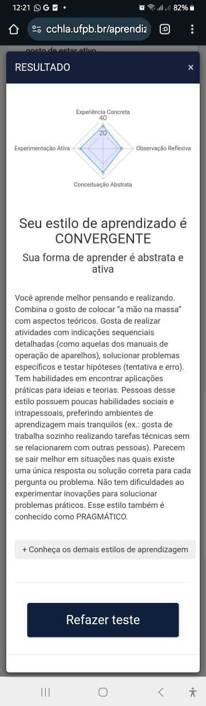

## Estilo de Aprendizagem

Eu fiz o teste no site [CCMD](https://www.cchla.ufpb.br/aprendizagem/). E meu estilo de aprendizagem é o **Convergente**.
De fato eu me identifico com as características do estilo de aprendizagem convergente.
Gosto do desafio, de resolver problemas, de pensar em soluções, de aprender coisas novas.
Aprender a **fazer, fazendo**, é o meu lema.
Meu fluxo de aprendizado e é ver funcionando, experimentar e testar, para então me aprofundar na teoria.
Adoro a parte teórica, mas a assimilo melhor, e mais rápido, apos ter aplicado o conhecimento na prática.

