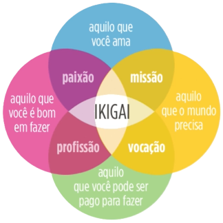

## Pensando em um intervalo de um ano:
### 1. Qual é meu Ikigai?

- Aquilo em que sou bom:
  - Em me colocar no lugar do outro;
  - Engenharia reversa;
  - Raciocínio lógico;

- Aquilo que posso ser pago para fazer:
  - Construir soluções com foco no cliente;
  - Desenvolver sistemas personalizados e sob demanda;
  - Integrar varias tecnologias para chegar no resultado desejado;

- Aquilo que o mundo precisa:
  - Automatizar e otimizar processos;

- Aquilo que eu amo:
  - Inovação e novidade;
  - Novos desafios;
  - Ajudar pessoas; 

### 2. Quais são as minha razões para **aprender** algo?
- Vontade de aplicar meus talentos e conhecimento na geração de valor;
- Alcançar a independência financeira;
- Trabalhar home office.

### 3. Onde eu quero me aprofundar?
Em ordem de prioridade:
- [ ] Dominar Python _(em andamento)_;
  - [x] Paradigma Orientado a Objeto;
  - [x] Paradigma Funcional;
  - [x] Boas Praticas;
  - [x] Programar em modo estrito;
  - [ ] Padrões de projetos;
  - [ ] SOLID.
- [ ] Usar API Gemini para criar soluções automatizadas com IA-PLN _(em andamento)_;
  - [x] Agente sem uso de IA-PLN de controle de agenda;
  - [x] Usar a API do Gemini para criar um agente simples de controle de agenda;
  - [ ] Criar um agente de controle de agenda de diálogo multiturnos com personalidade;
  - [ ] Integrar o agente com personalidade com a API do WhatsApp;
  - [ ] Perssistir os dados da agenda no MariaDB;
  - [ ] Subir os microservisos do agente e do banco de dados para uma VPS;
  - [ ] Testa o projeto em produção (Buscar um parceiro que aceite testar minha solução);
- [ ] Aprender desenvolvimento back-end em Python;
  - [ ] Aprender a criar APIs RESTful - FastAPI & SQLAlchemy;
  - [ ] Aprender a criar APIs GraphQL - Strawberry & Ariadne;
- [ ] Aprender a percistir dados com MySQL(MariaDB) e MongoDB;
- [ ] Ciência de dados.
- [ ] Conseguir um **Certificado Oracle**, por meio do Alura-ONE.
